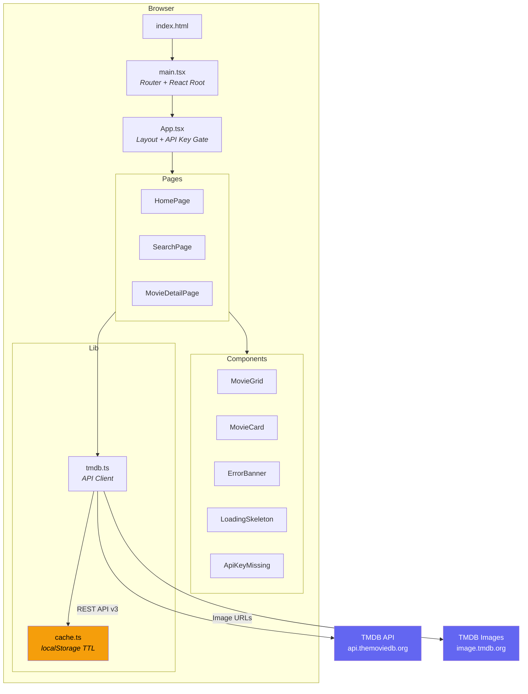
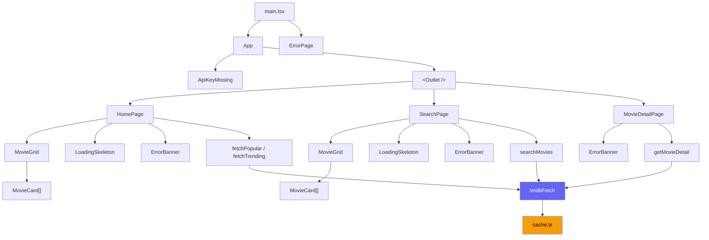
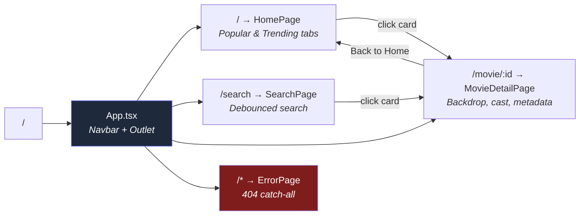
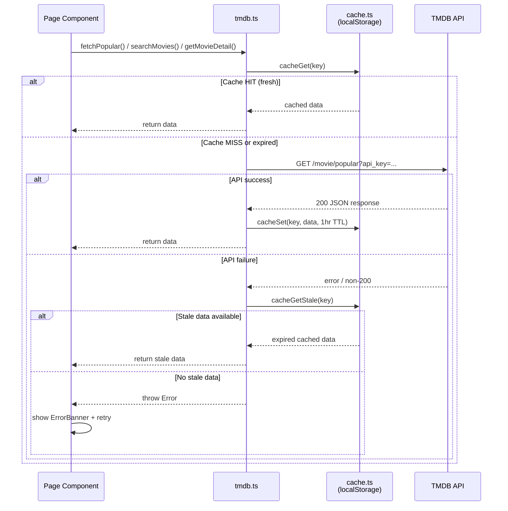
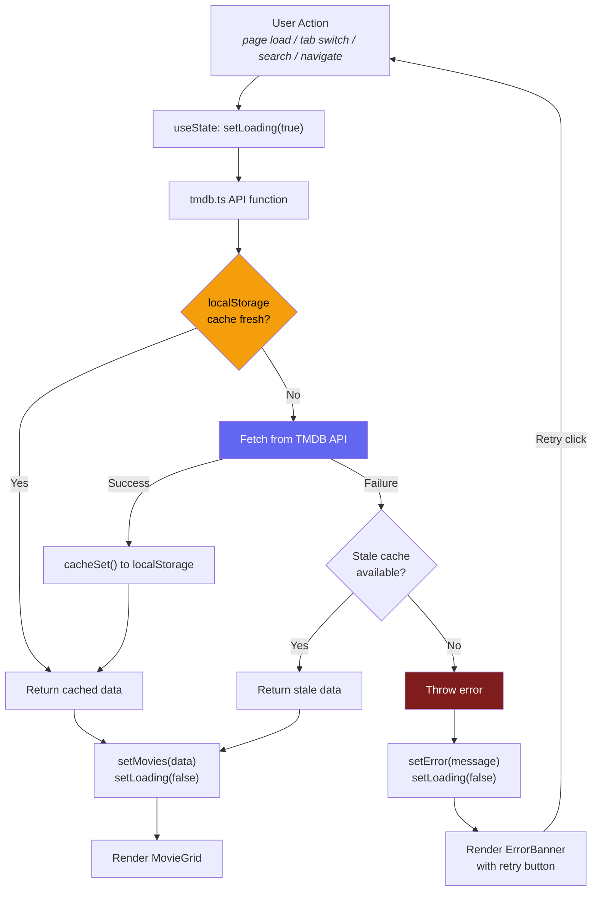

# bmad-moviedb Diagrams

## Architecture Overview

```mermaid
graph TD
    subgraph Browser
        HTML["index.html"]
        HTML --> Main["main.tsx<br/><i>Router + React Root</i>"]
        Main --> App["App.tsx<br/><i>Layout + API Key Gate</i>"]

        subgraph Pages
            HP["HomePage"]
            SP["SearchPage"]
            MDP["MovieDetailPage"]
        end

        subgraph Components
            MG["MovieGrid"]
            MC["MovieCard"]
            EB["ErrorBanner"]
            LS["LoadingSkeleton"]
            AKM["ApiKeyMissing"]
        end

        subgraph Lib
            TMDB["tmdb.ts<br/><i>API Client</i>"]
            Cache["cache.ts<br/><i>localStorage TTL</i>"]
        end

        App --> Pages
        Pages --> Components
        Pages --> TMDB
        TMDB --> Cache
    end

    TMDB -- "REST API v3" --> API["TMDB API<br/>api.themoviedb.org"]
    TMDB -- "Image URLs" --> IMG["TMDB Images<br/>image.tmdb.org"]

    style API fill:#6366f1,color:#fff
    style IMG fill:#6366f1,color:#fff
    style Cache fill:#f59e0b,color:#000
```

## Component Dependency Tree

```mermaid
graph TD
    main["main.tsx"] --> App
    main --> EP["ErrorPage"]

    App --> AKM["ApiKeyMissing"]
    App --> Outlet["&lt;Outlet /&gt;"]

    Outlet --> HP["HomePage"]
    Outlet --> SP["SearchPage"]
    Outlet --> MDP["MovieDetailPage"]

    HP --> MG1["MovieGrid"]
    HP --> LS1["LoadingSkeleton"]
    HP --> EB1["ErrorBanner"]

    SP --> MG2["MovieGrid"]
    SP --> LS2["LoadingSkeleton"]
    SP --> EB2["ErrorBanner"]

    MDP --> EB3["ErrorBanner"]

    MG1 --> MC1["MovieCard[]"]
    MG2 --> MC2["MovieCard[]"]

    HP --> tmdb1["fetchPopular / fetchTrending"]
    SP --> tmdb2["searchMovies"]
    MDP --> tmdb3["getMovieDetail"]

    tmdb1 --> tmdbFetch
    tmdb2 --> tmdbFetch
    tmdb3 --> tmdbFetch
    tmdbFetch --> cache["cache.ts"]

    style tmdbFetch fill:#6366f1,color:#fff
    style cache fill:#f59e0b,color:#000
```

## Routing Map

```mermaid
graph LR
    Root["/"] --> Layout["App.tsx<br/><i>Navbar + Outlet</i>"]

    Layout --> Home["/ → HomePage<br/><i>Popular & Trending tabs</i>"]
    Layout --> Search["/search → SearchPage<br/><i>Debounced search</i>"]
    Layout --> Detail["/movie/:id → MovieDetailPage<br/><i>Backdrop, cast, metadata</i>"]
    Layout --> NotFound["/* → ErrorPage<br/><i>404 catch-all</i>"]

    Home -- "click card" --> Detail
    Search -- "click card" --> Detail
    Detail -- "Back to Home" --> Home

    style Layout fill:#1e293b,color:#fff,stroke:#6366f1
    style NotFound fill:#7f1d1d,color:#fff
```

## API Request Lifecycle

```mermaid
sequenceDiagram
    participant P as Page Component
    participant T as tmdb.ts
    participant C as cache.ts<br/>(localStorage)
    participant A as TMDB API

    P->>T: fetchPopular() / searchMovies() / getMovieDetail()
    T->>C: cacheGet(key)

    alt Cache HIT (fresh)
        C-->>T: cached data
        T-->>P: return data
    else Cache MISS or expired
        T->>A: GET /movie/popular?api_key=...
        alt API success
            A-->>T: 200 JSON response
            T->>C: cacheSet(key, data, 1hr TTL)
            T-->>P: return data
        else API failure
            A-->>T: error / non-200
            T->>C: cacheGetStale(key)
            alt Stale data available
                C-->>T: expired cached data
                T-->>P: return stale data
            else No stale data
                T-->>P: throw Error
                P->>P: show ErrorBanner + retry
            end
        end
    end
```

## Data Flow: User Action to Render

```mermaid
graph TD
    UA["User Action<br/><i>page load / tab switch / search / navigate</i>"]
    UA --> State["useState: setLoading(true)"]
    State --> Fetch["tmdb.ts API function"]
    Fetch --> CacheCheck{"localStorage<br/>cache fresh?"}

    CacheCheck -- "Yes" --> Return["Return cached data"]
    CacheCheck -- "No" --> API["Fetch from TMDB API"]

    API -- "Success" --> Store["cacheSet() to localStorage"]
    Store --> Return

    API -- "Failure" --> Stale{"Stale cache<br/>available?"}
    Stale -- "Yes" --> ReturnStale["Return stale data"]
    Stale -- "No" --> Throw["Throw error"]

    Return --> SetState["setMovies(data)<br/>setLoading(false)"]
    ReturnStale --> SetState
    Throw --> SetError["setError(message)<br/>setLoading(false)"]

    SetState --> Render["Render MovieGrid"]
    SetError --> RenderErr["Render ErrorBanner<br/>with retry button"]

    RenderErr -- "Retry click" --> UA

    style CacheCheck fill:#f59e0b,color:#000
    style API fill:#6366f1,color:#fff
    style Throw fill:#7f1d1d,color:#fff
```
